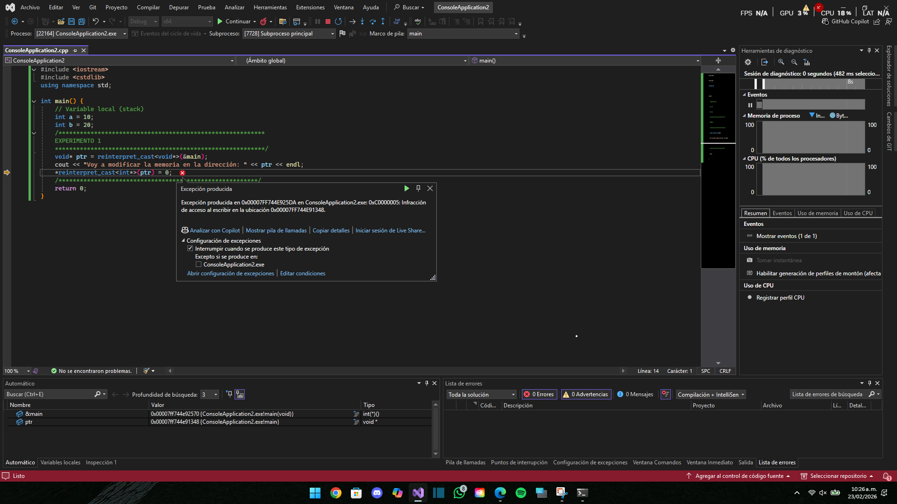
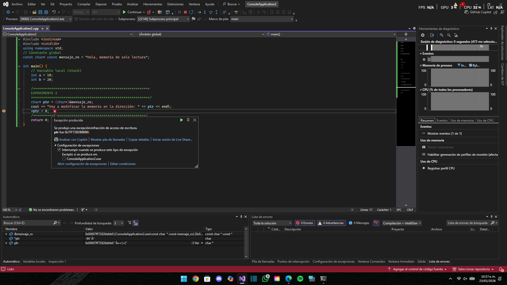
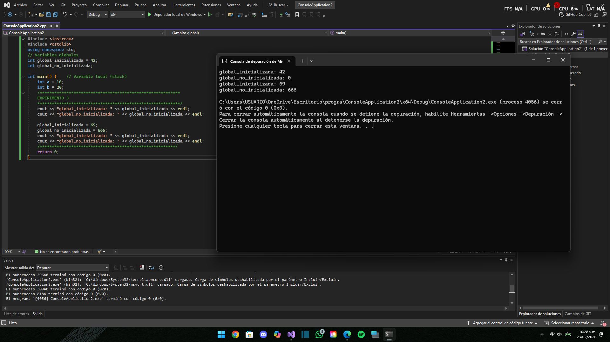
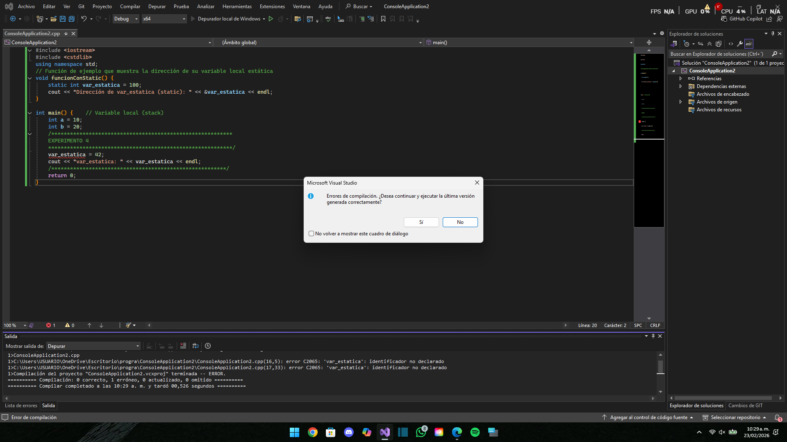
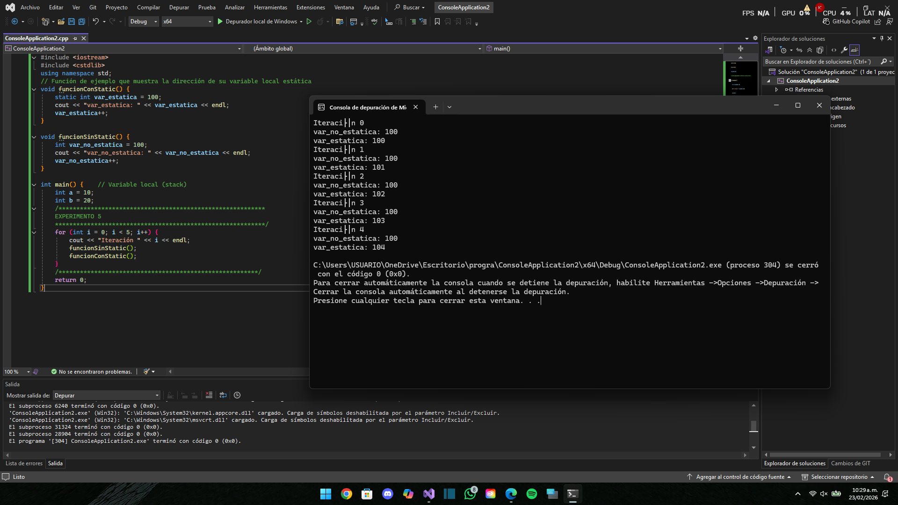
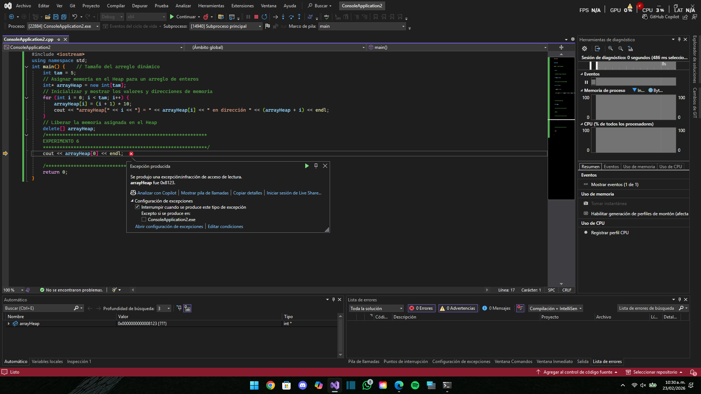

experimento 1

el programa intenta sobre escribir en el espacio de memoria del main un 0 (reinterpret_cast)

experimento 2

el programa intenta convertir la contante mansaje_ro a tipo char

experimento 3

cambia de valor global_inicializada y global_no_inicializada

experimento 4

se intenta cambiar de valor var_estatica

experimento 5

la variable no estatica se reinicia cada vez que se llama y las estaticas se quedan como vayan

experimento 6 

busca una variable que no existe en el array

