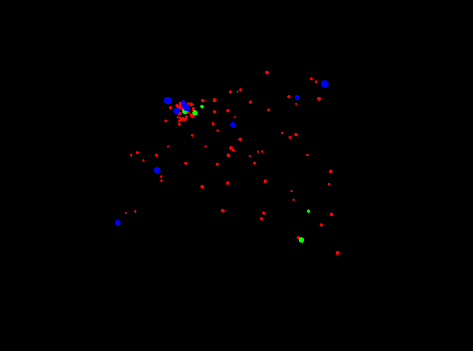
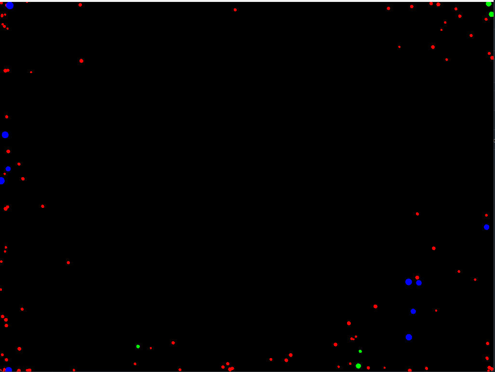
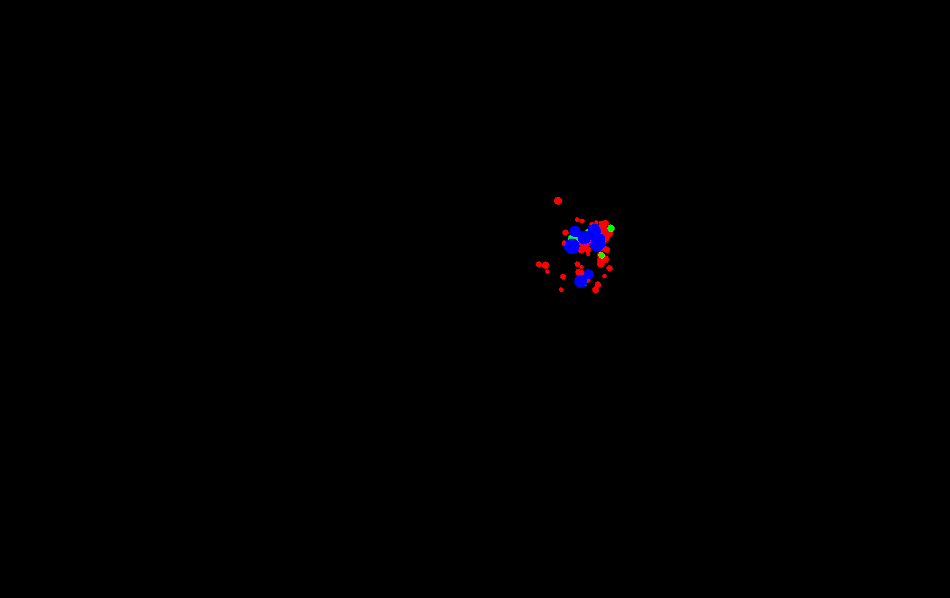
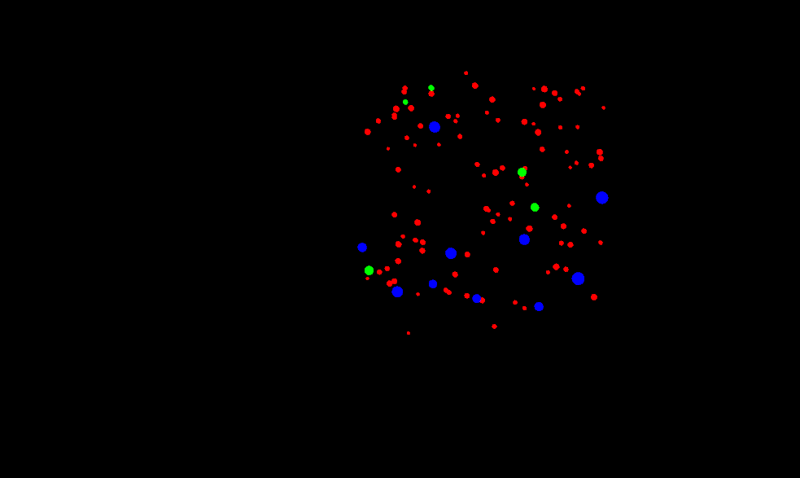

1. ¿Cómo puedes interactuar con la aplicación? Menciona específicamente las teclas y qué efecto parecen tener sobre las partículas.

con la tecla A se atreaen, con la tecla N se devuelven a el estado normal, con la tecla R se repelen, con la S se detienen.

2. ¿Observas los diferentes tipos de “partículas”? ¿Se comportan todas igual inicialmente?

no se comportan igual, asi sean la misma particula hay algunas que se mueven mas lentas que otras

3. Toma algunas capturas de pantalla de la aplicación en diferentes momentos (estado inicial, después de presionar ‘a’, ‘r’, ‘s’, ‘n’) y añádelas a tu bitácora.

a

r

s

n

4. ¿Qué crees que está pasando “detrás de cámaras” cuando presionas las teclas? Formula una hipótesis inicial sobre cómo la aplicación cambia el comportamiento de las partículas.

se interpolan las suscripciones de las particulas y reaccionan