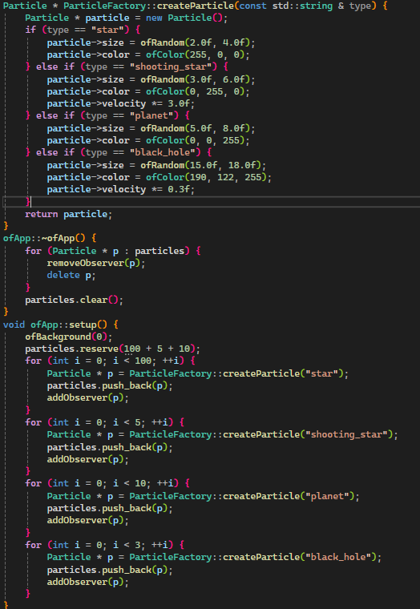

1. El código fuente completo de tu proyecto openFrameworks.

2. Explica cómo usaste el patrón Factory para esta nueva partícula.
se agrega una nueva instancia a ParticleFactory con su numbre, tamaño y color

3. Describe cómo implementaste el patrón Observer para esta nueva partícula.
se agrega la nueva particula con su propio conteo de particulas 
4. Explica cómo aplicaste el patrón State a esta nueva partícula.
